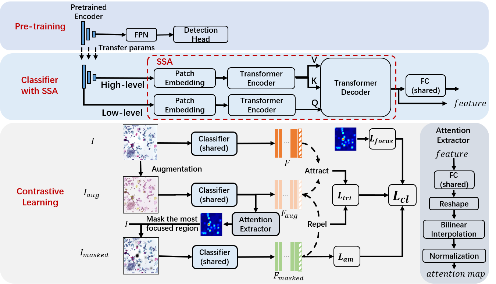

# Progressive Attention Guidance for Whole Slide Vulvovaginal Candidiasis Screening

Authors:
Jiangdong Cai<sup>1</sup>,
Honglin Xiong<sup>1</sup>, 
Maosong Cao<sup>1</sup>,
Luyan Liu<sup>1</sup>, 
Lichi Zhang<sup>2</sup>, 
Qian Wang<sup>1</sup><br>
<sup>1</sup>ShanghaiTech University, <sup>2</sup>Shanghai Jiao Tong University

This repository contains the implementation of the methods described in "Progressive Attention Guidance for Whole Slide Vulvovaginal Candidiasis Screening", which is submitted to MICCAI 2023.


<hr />

> **Abstract:** *Vulvovaginal candidiasis (VVC) is the most prevalent human candidal infection, estimated to afflict approximately 75$\%$ of all women at least once in their lifetime. It will lead to several symptoms including pruritus, vaginal soreness, and so on. Automatic whole slide image (WSI) classification is highly demanded, for the huge burden of disease control and prevention. However, the WSI-based computer-aided VCC screening method is still vacant due to the scarce labeled data and unique properties of candida. Candida in WSI is challenging to be captured by conventional classification models due to its distinctive elongated shape, the small proportion of their spatial distribution, and the style gap from WSIs. To make the model focus on the candida easier, we propose an attention-guided method, which can obtain a robust diagnosis classification model. Specifically, we first use a pre-trained detection model as prior instruction to initialize the classification model. Then we design a Skip Self-Attention module to refine the attention onto the fined-grained features of candida. Finally, we use a contrastive learning method to alleviate the overfitting caused by the style gap of WSIs and suppress the attention to false positive regions. Our experimental results demonstrate that our framework achieves state-of-the-art performance.* 
<hr />


## Method


Attention Guided Image-level Classification
 

## Requirements

[//]: # (Run `python setup.py develop --no_cuda_ext` to install basicsr.)
```
 Coming soon.

```

## Example usage

[//]: # (Run `python setup.py develop --no_cuda_ext` to install basicsr.)
```
 Coming soon.

```


 